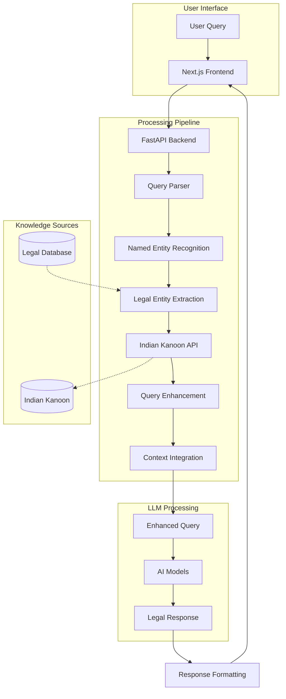

# Code Legalist - AI-Powered Legal Assistant

An intelligent legal assistant that helps users understand Indian laws and legal concepts using advanced AI models and comprehensive legal databases.

## Architecture


## Features

- 🤖 Dual AI Model Support (Mistral & Google Gemini)
- 📚 Indian Legal Database Integration
- 🔍 Legal Entity Recognition
- 💬 Real-time Chat Interface
- 🎨 Modern, Responsive UI
- 🔄 Model Preference Toggle
- 📝 Markdown Support
- ⚡ Fast Response Times

## Tech Stack

### Frontend
- Next.js 14
- React 18
- TailwindCSS
- Framer Motion
- Vercel AI SDK

### Backend
- FastAPI
- Python 3.10+
- Mistral AI
- Google Gemini
- Indian Kanoon API Integration
- Named Entity Recognition

## Setup

### Backend Setup
1. Navigate to backend directory:
```bash
cd backend
```

2. Create and activate virtual environment:
```bash
python -m venv venv
source venv/bin/activate  # On Windows: venv\Scripts\activate
```

3. Install dependencies:
```bash
pip install -r requirements.txt
```

4. Create .env file:
```bash
cp .env.example .env
# Edit .env with your API keys
```

5. Run the backend:
```bash
uvicorn main:app --reload
```

### Frontend Setup
1. Navigate to frontend directory:
```bash
cd frontend
```

2. Install dependencies:
```bash
npm install
```

3. Create .env.local:
```bash
cp .env.example .env.local
# Edit .env.local with your settings
```

4. Run the development server:
```bash
npm run dev
```

## Environment Variables

### Backend
- `MISTRAL_API_KEY`: Mistral AI API key
- `GEMINI_API_KEY`: Google Gemini API key
- `IK_API_KEY`: Indian Kanoon API key

### Frontend
- `BACKEND_URL`: Backend API URL (default: http://localhost:8000)

## Deployment

### Backend
- Deployed on Google Cloud Run
- Configured with 4GB memory and 2 CPU cores
- Auto-scaling enabled

### Frontend
- Deployed on Vercel
- Optimized for edge runtime
- Configured with environment variables

## API Documentation

Once the server is running, access:
- Swagger UI: `http://localhost:8000/docs`
- ReDoc: `http://localhost:8000/redoc`

## Contributing

1. Fork the repository
2. Create your feature branch
3. Commit your changes
4. Push to the branch
5. Create a Pull Request

## License

This project is licensed under the MIT License - see the [LICENSE](LICENSE) file for details. 