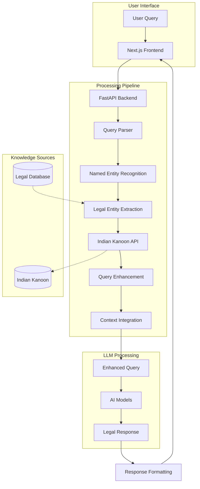

# Code Legalist

A sophisticated legal assistant platform designed to help users understand Indian laws and legal concepts through advanced AI models and comprehensive legal databases.

## Overview

Code Legalist combines cutting-edge AI technology with extensive legal databases to provide accurate, context-aware responses to legal queries. The system leverages multiple AI models and integrates with Indian legal repositories to ensure comprehensive and up-to-date information.

## Key Features

- **Dual AI Model Integration**
  - Mistral AI for advanced language processing
  - Google Gemini for enhanced context understanding

- **Legal Information Processing**
  - Indian Legal Database Integration
  - Legal Entity Recognition
  - Automated Case Law Analysis

- **User Interface**
  - Real-time Chat Interface
  - Modern, Responsive Design
  - Model Preference Selection
  - Rich Text Formatting Support

- **Performance**
  - Fast Response Times
  - Scalable Architecture
  - Reliable Error Handling

## System Architecture


## Technical Stack

### Frontend Technologies
- Next.js 14 for server-side rendering
- React 18 for UI components
- TailwindCSS for styling
- Framer Motion for animations
- Vercel AI SDK for AI integration

### Backend Technologies
- FastAPI for high-performance API
- Python 3.10+ runtime
- Mistral AI integration
- Google Gemini integration
- Indian Kanoon API services
- Custom Named Entity Recognition

## Installation Guide

### Backend Configuration
1. Initialize backend environment:
```bash
cd backend
python -m venv venv
source venv/bin/activate  # For Windows: venv\Scripts\activate
```

2. Install required packages:
```bash
pip install -r requirements.txt
```

3. Configure environment variables:
```bash
cp .env.example .env
# Update .env with appropriate API keys
```

4. Launch backend server:
```bash
uvicorn main:app --reload
```

### Frontend Configuration
1. Initialize frontend environment:
```bash
cd frontend
npm install
```

2. Configure environment settings:
```bash
cp .env.example .env.local
# Update .env.local with appropriate settings
```

3. Launch development server:
```bash
npm run dev
```

## Environment Configuration

### Backend Variables
| Variable | Description | Required |
|----------|-------------|----------|
| MISTRAL_API_KEY | Authentication key for Mistral AI | Yes |
| GEMINI_API_KEY | Authentication key for Google Gemini | Yes |
| IK_API_KEY | Authentication key for Indian Kanoon | Yes |

### Frontend Variables
| Variable | Description | Default |
|----------|-------------|---------|
| BACKEND_URL | Backend service endpoint | http://localhost:8000 |

## Deployment Architecture

### Backend Deployment (Google Cloud Run)
- Runtime Configuration:
  - Memory Allocation: 4GB
  - CPU Allocation: 2 cores
  - Auto-scaling enabled
  - HTTPS endpoint

### Frontend Deployment (Vercel)
- Configuration:
  - Edge Runtime optimization
  - Environment variable integration
  - Automatic HTTPS
  - CDN distribution

## API Documentation

### Access Points
- Interactive Documentation: `http://localhost:8000/docs`
- Alternative Documentation: `http://localhost:8000/redoc`

## Development Guidelines

### Contributing Process
1. Fork the repository
2. Create a feature branch
3. Implement changes
4. Submit pull request
5. Await review and merge

### Code Standards
- Follow PEP 8 for Python code
- Adhere to ESLint configuration for JavaScript
- Maintain comprehensive documentation
- Include appropriate test coverage

## License Information

This project is distributed under the MIT License. See the [LICENSE](LICENSE) file for complete details. 